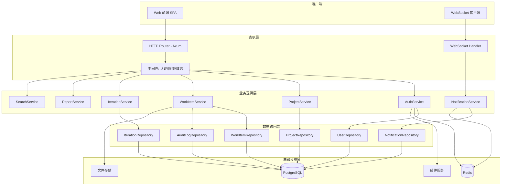
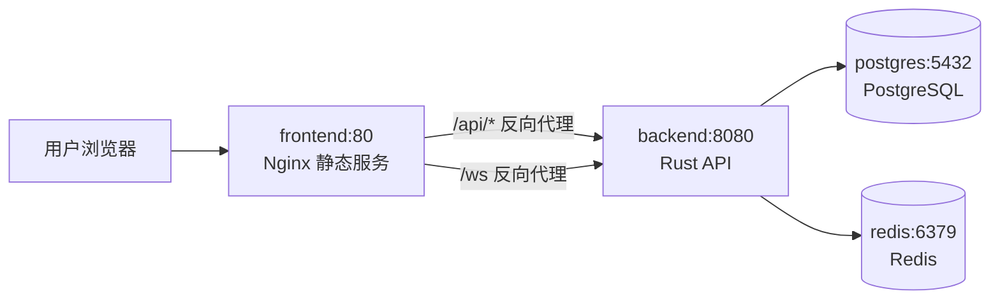

# IT需求管理系统 - 技术设计文档

## 概述

IT需求管理系统（my_tapd）是一个面向研发团队的敏捷项目管理平台，使用 Rust 语言实现，提供需求全生命周期管理能力。系统支持多角色协作，涵盖需求收集、迭代规划、开发跟踪、测试验收等核心流程。

### 技术选型

- **语言**：Rust（2024 edition）
- **Web 框架**：Axum（异步 HTTP 服务）
- **数据库**：PostgreSQL（主数据存储）+ Redis（缓存、会话、实时通知队列）
- **ORM**：SQLx（异步、编译期 SQL 检查）
- **认证**：JWT（访问令牌）+ bcrypt（密码哈希）
- **实时通信**：WebSocket（站内通知推送）
- **搜索**：PostgreSQL 全文搜索（pg_trgm 扩展）
- **文件存储**：本地文件系统 / S3 兼容对象存储
- **序列化**：serde + serde_json
- **测试**：proptest（属性测试）+ tokio-test（异步测试）

---

## 架构

系统采用分层架构，分为表示层、业务逻辑层、数据访问层和基础设施层。



### 目录结构

```
src/
├── main.rs                  # 启动入口
├── config.rs                # 配置加载
├── error.rs                 # 统一错误类型
├── db.rs                    # 数据库连接池
├── domain/                  # 领域模型
│   ├── mod.rs
│   ├── user.rs
│   ├── project.rs
│   ├── work_item.rs
│   ├── iteration.rs
│   ├── notification.rs
│   └── audit.rs
├── repository/              # 数据访问层
│   ├── mod.rs
│   ├── user_repo.rs
│   ├── project_repo.rs
│   ├── work_item_repo.rs
│   ├── iteration_repo.rs
│   ├── notification_repo.rs
│   └── audit_repo.rs
├── service/                 # 业务逻辑层
│   ├── mod.rs
│   ├── auth_service.rs
│   ├── project_service.rs
│   ├── work_item_service.rs
│   ├── iteration_service.rs
│   ├── notification_service.rs
│   ├── report_service.rs
│   └── search_service.rs
├── api/                     # HTTP 路由与处理器
│   ├── mod.rs
│   ├── router.rs
│   ├── middleware.rs
│   ├── auth.rs
│   ├── projects.rs
│   ├── work_items.rs
│   ├── iterations.rs
│   ├── notifications.rs
│   ├── reports.rs
│   └── search.rs
└── ws/                      # WebSocket 处理
    ├── mod.rs
    └── handler.rs
```

---

## 组件与接口

### 核心服务接口

#### AuthService

```rust
pub trait AuthService: Send + Sync {
    async fn register(&self, req: RegisterRequest) -> Result<User, AppError>;
    async fn verify_email(&self, token: &str) -> Result<(), AppError>;
    async fn login(&self, req: LoginRequest) -> Result<AuthToken, AppError>;
    async fn logout(&self, user_id: UserId, token: &str) -> Result<(), AppError>;
    async fn request_password_reset(&self, email: &str) -> Result<(), AppError>;
    async fn reset_password(&self, token: &str, new_password: &str) -> Result<(), AppError>;
    async fn update_profile(&self, user_id: UserId, req: UpdateProfileRequest) -> Result<User, AppError>;
}
```

#### ProjectService

```rust
pub trait ProjectService: Send + Sync {
    async fn create_project(&self, creator_id: UserId, req: CreateProjectRequest) -> Result<Project, AppError>;
    async fn archive_project(&self, operator_id: UserId, project_id: ProjectId) -> Result<(), AppError>;
    async fn invite_member(&self, operator_id: UserId, project_id: ProjectId, req: InviteMemberRequest) -> Result<Member, AppError>;
    async fn remove_member(&self, operator_id: UserId, project_id: ProjectId, member_id: UserId) -> Result<(), AppError>;
    async fn update_project(&self, operator_id: UserId, project_id: ProjectId, req: UpdateProjectRequest) -> Result<Project, AppError>;
    async fn get_project(&self, requester_id: UserId, project_id: ProjectId) -> Result<Project, AppError>;
}
```

#### WorkItemService

```rust
pub trait WorkItemService: Send + Sync {
    async fn create_requirement(&self, creator_id: UserId, project_id: ProjectId, req: CreateRequirementRequest) -> Result<WorkItem, AppError>;
    async fn create_story(&self, creator_id: UserId, parent_req_id: WorkItemId, req: CreateStoryRequest) -> Result<WorkItem, AppError>;
    async fn create_task(&self, creator_id: UserId, parent_story_id: WorkItemId, req: CreateTaskRequest) -> Result<WorkItem, AppError>;
    async fn create_bug(&self, creator_id: UserId, project_id: ProjectId, req: CreateBugRequest) -> Result<WorkItem, AppError>;
    async fn update_status(&self, operator_id: UserId, item_id: WorkItemId, new_status: Status) -> Result<WorkItem, AppError>;
    async fn assign(&self, operator_id: UserId, item_id: WorkItemId, assignee_id: UserId) -> Result<WorkItem, AppError>;
    async fn log_actual_hours(&self, operator_id: UserId, task_id: WorkItemId, hours: f32) -> Result<WorkItem, AppError>;
    async fn add_comment(&self, author_id: UserId, item_id: WorkItemId, content: &str) -> Result<Comment, AppError>;
    async fn upload_attachment(&self, uploader_id: UserId, item_id: WorkItemId, file: FileUpload) -> Result<Attachment, AppError>;
    async fn list_work_items(&self, requester_id: UserId, project_id: ProjectId, filter: WorkItemFilter) -> Result<Vec<WorkItem>, AppError>;
    async fn get_change_history(&self, requester_id: UserId, item_id: WorkItemId) -> Result<Vec<AuditLog>, AppError>;
}
```

#### IterationService

```rust
pub trait IterationService: Send + Sync {
    async fn create_iteration(&self, operator_id: UserId, project_id: ProjectId, req: CreateIterationRequest) -> Result<Iteration, AppError>;
    async fn update_iteration(&self, operator_id: UserId, iteration_id: IterationId, req: UpdateIterationRequest) -> Result<Iteration, AppError>;
    async fn assign_stories(&self, operator_id: UserId, iteration_id: IterationId, story_ids: Vec<WorkItemId>) -> Result<(), AppError>;
    async fn close_iteration(&self, iteration_id: IterationId) -> Result<IterationSummary, AppError>;
    async fn get_burndown_data(&self, iteration_id: IterationId) -> Result<BurndownChart, AppError>;
}
```

#### NotificationService

```rust
pub trait NotificationService: Send + Sync {
    async fn send(&self, notification: NewNotification) -> Result<(), AppError>;
    async fn list_notifications(&self, user_id: UserId, page: Pagination) -> Result<Vec<Notification>, AppError>;
    async fn mark_read(&self, user_id: UserId, notification_ids: Vec<NotificationId>) -> Result<(), AppError>;
    async fn mark_all_read(&self, user_id: UserId) -> Result<(), AppError>;
    async fn update_preferences(&self, user_id: UserId, prefs: NotificationPreferences) -> Result<(), AppError>;
}
```

#### SearchService

```rust
pub trait SearchService: Send + Sync {
    async fn search(&self, requester_id: UserId, project_id: ProjectId, query: SearchQuery) -> Result<SearchResult, AppError>;
    async fn find_by_number(&self, requester_id: UserId, project_id: ProjectId, number: &str) -> Result<WorkItem, AppError>;
}
```

---

## 数据模型

### 核心领域类型

```rust
// ---- 基础类型 ----
pub type UserId       = i64;
pub type ProjectId    = i64;
pub type WorkItemId   = i64;
pub type IterationId  = i64;
pub type NotificationId = i64;
pub type CommentId    = i64;
pub type AttachmentId = i64;

// ---- 枚举 ----

#[derive(Debug, Clone, PartialEq, Eq, Serialize, Deserialize, sqlx::Type)]
#[sqlx(type_name = "work_item_type", rename_all = "snake_case")]
pub enum WorkItemType { Requirement, Story, Task, Bug }

#[derive(Debug, Clone, PartialEq, Eq, Serialize, Deserialize, sqlx::Type)]
#[sqlx(type_name = "status", rename_all = "snake_case")]
pub enum Status {
    Pending,       // 待处理
    InProgress,    // 进行中
    Done,          // 已完成
    Closed,        // 已关闭
    Rejected,      // 已拒绝（Bug 专用）
    PendingVerify, // 待验证（Bug 专用）
    Fixing,        // 修复中（Bug 专用）
    Unassigned,    // 待分配（成员移除后）
}

#[derive(Debug, Clone, PartialEq, Eq, Serialize, Deserialize, sqlx::Type)]
#[sqlx(type_name = "priority", rename_all = "snake_case")]
pub enum Priority { Urgent, High, Medium, Low }

#[derive(Debug, Clone, PartialEq, Eq, Serialize, Deserialize, sqlx::Type)]
#[sqlx(type_name = "role", rename_all = "snake_case")]
pub enum Role { Admin, Developer, Tester, Observer }

#[derive(Debug, Clone, PartialEq, Eq, Serialize, Deserialize, sqlx::Type)]
#[sqlx(type_name = "project_type", rename_all = "snake_case")]
pub enum ProjectType { Agile, Waterfall }

#[derive(Debug, Clone, PartialEq, Eq, Serialize, Deserialize, sqlx::Type)]
#[sqlx(type_name = "severity", rename_all = "snake_case")]
pub enum Severity { Fatal, Critical, Normal, Hint }

#[derive(Debug, Clone, PartialEq, Eq, Serialize, Deserialize, sqlx::Type)]
#[sqlx(type_name = "iteration_status", rename_all = "snake_case")]
pub enum IterationStatus { NotStarted, InProgress, Completed }
```

### 数据库表结构

```rust
// users 表
pub struct User {
    pub id:           UserId,
    pub email:        String,          // UNIQUE NOT NULL
    pub password_hash: String,         // bcrypt hash
    pub nickname:     String,
    pub avatar_url:   Option<String>,
    pub phone:        Option<String>,
    pub is_active:    bool,            // 邮箱验证后为 true
    pub login_fail_count: i32,
    pub locked_until: Option<DateTime<Utc>>,
    pub created_at:   DateTime<Utc>,
    pub updated_at:   DateTime<Utc>,
}

// projects 表
pub struct Project {
    pub id:          ProjectId,
    pub name:        String,
    pub description: Option<String>,
    pub project_type: ProjectType,
    pub is_public:   bool,
    pub is_archived: bool,
    pub created_by:  UserId,
    pub created_at:  DateTime<Utc>,
    pub updated_at:  DateTime<Utc>,
}

// project_members 表
pub struct Member {
    pub project_id: ProjectId,
    pub user_id:    UserId,
    pub role:       Role,
    pub joined_at:  DateTime<Utc>,
}

// work_items 表（统一存储 Requirement/Story/Task/Bug）
pub struct WorkItem {
    pub id:            WorkItemId,
    pub project_id:    ProjectId,
    pub item_type:     WorkItemType,
    pub number:        String,         // 唯一编号，如 REQ-001, BUG-042
    pub title:         String,
    pub description:   Option<String>,
    pub status:        Status,
    pub priority:      Priority,
    pub assignee_id:   Option<UserId>,
    pub creator_id:    UserId,
    pub parent_id:     Option<WorkItemId>,  // Story -> Requirement, Task -> Story
    pub iteration_id:  Option<IterationId>,
    pub due_date:      Option<NaiveDate>,
    pub story_points:  Option<i32>,         // Story 专用
    pub estimated_hours: Option<f32>,       // Task 专用
    pub actual_hours:  Option<f32>,         // Task 专用，精度 0.5h
    pub severity:      Option<Severity>,    // Bug 专用
    pub repro_steps:   Option<String>,      // Bug 专用
    pub reopen_reason: Option<String>,      // Bug 重开原因
    pub completion_pct: Option<i32>,        // Story 完成百分比 0-100
    pub created_at:    DateTime<Utc>,
    pub updated_at:    DateTime<Utc>,
}

// work_item_labels 表（多对多）
pub struct WorkItemLabel {
    pub work_item_id: WorkItemId,
    pub label:        String,
}

// iterations 表
pub struct Iteration {
    pub id:          IterationId,
    pub project_id:  ProjectId,
    pub name:        String,
    pub goal:        Option<String>,
    pub start_date:  NaiveDate,
    pub end_date:    NaiveDate,
    pub status:      IterationStatus,
    pub created_by:  UserId,
    pub created_at:  DateTime<Utc>,
    pub updated_at:  DateTime<Utc>,
}

// comments 表
pub struct Comment {
    pub id:          CommentId,
    pub work_item_id: WorkItemId,
    pub author_id:   UserId,
    pub content:     String,
    pub created_at:  DateTime<Utc>,
}

// attachments 表
pub struct Attachment {
    pub id:          AttachmentId,
    pub work_item_id: WorkItemId,
    pub uploader_id: UserId,
    pub filename:    String,
    pub file_size:   i64,              // bytes，最大 20MB
    pub storage_key: String,           // 存储路径/对象键
    pub created_at:  DateTime<Utc>,
}

// audit_logs 表（变更历史）
pub struct AuditLog {
    pub id:          i64,
    pub work_item_id: WorkItemId,
    pub operator_id: UserId,
    pub field_name:  String,
    pub old_value:   Option<String>,
    pub new_value:   Option<String>,
    pub changed_at:  DateTime<Utc>,
}

// notifications 表
pub struct Notification {
    pub id:          NotificationId,
    pub user_id:     UserId,           // 接收者
    pub event_type:  String,           // assigned / status_changed / commented 等
    pub work_item_id: Option<WorkItemId>,
    pub content:     String,
    pub is_read:     bool,
    pub retry_count: i32,
    pub created_at:  DateTime<Utc>,
}

// notification_preferences 表
pub struct NotificationPreferences {
    pub user_id:          UserId,
    pub on_assigned:      bool,
    pub on_status_change: bool,
    pub on_comment:       bool,
    pub on_due_date:      bool,
}

// burndown_snapshots 表（每日快照）
pub struct BurndownSnapshot {
    pub id:           i64,
    pub iteration_id: IterationId,
    pub snapshot_date: NaiveDate,
    pub remaining_points: i32,
    pub total_points:  i32,
}
```

### 数据库索引设计

```sql
-- work_items 核心查询索引
CREATE INDEX idx_work_items_project_type   ON work_items(project_id, item_type);
CREATE INDEX idx_work_items_assignee       ON work_items(assignee_id);
CREATE INDEX idx_work_items_iteration      ON work_items(iteration_id);
CREATE INDEX idx_work_items_parent         ON work_items(parent_id);
CREATE INDEX idx_work_items_number         ON work_items(project_id, number);
CREATE INDEX idx_work_items_due_date       ON work_items(due_date) WHERE status != 'done';

-- 全文搜索索引
CREATE INDEX idx_work_items_fts ON work_items
    USING GIN(to_tsvector('simple', title || ' ' || COALESCE(description, '')));

-- 通知查询索引
CREATE INDEX idx_notifications_user_unread ON notifications(user_id, is_read)
    WHERE is_read = false;

-- 迭代时间范围索引
CREATE INDEX idx_iterations_project_dates ON iterations(project_id, start_date, end_date);
```

---

## 核心算法与关键函数

### 1. 账户锁定逻辑

```rust
/// 登录失败计数与锁定检查
/// 需求 1.4：连续 5 次失败锁定 15 分钟
pub fn check_account_lock(user: &User, now: DateTime<Utc>) -> Result<(), AppError> {
    if let Some(locked_until) = user.locked_until {
        if now < locked_until {
            return Err(AppError::AccountLocked { until: locked_until });
        }
    }
    Ok(())
}

pub fn should_lock_account(fail_count: i32) -> Option<Duration> {
    if fail_count >= 5 {
        Some(Duration::minutes(15))
    } else {
        None
    }
}
```

### 2. 密码令牌有效期验证

```rust
/// 需求 1.5：重置令牌有效期 30 分钟
pub fn is_token_valid(issued_at: DateTime<Utc>, now: DateTime<Utc>, ttl: Duration) -> bool {
    now < issued_at + ttl
}
```

### 3. 迭代时间冲突检测

```rust
/// 需求 5.2：检测迭代时间范围重叠
/// 两个区间 [a_start, a_end] 和 [b_start, b_end] 重叠条件：a_start <= b_end && b_start <= a_end
pub fn iterations_overlap(a: &Iteration, b: &Iteration) -> bool {
    a.start_date <= b.end_date && b.start_date <= a.end_date
}

pub fn find_conflicting_iteration<'a>(
    new_start: NaiveDate,
    new_end: NaiveDate,
    existing: &'a [Iteration],
) -> Option<&'a Iteration> {
    existing.iter().find(|it| {
        it.status != IterationStatus::Completed
            && new_start <= it.end_date
            && it.start_date <= new_end
    })
}
```

### 4. Story 完成百分比计算

```rust
/// 需求 4.3：完成百分比 = 已完成 Task 数 / 总 Task 数 × 100
pub fn calc_completion_pct(tasks: &[WorkItem]) -> i32 {
    if tasks.is_empty() {
        return 0;
    }
    let done = tasks.iter().filter(|t| t.status == Status::Done).count();
    ((done as f64 / tasks.len() as f64) * 100.0).round() as i32
}
```

### 5. 工时精度校验

```rust
/// 需求 4.5：实际工时精度为 0.5 小时
pub fn is_valid_hours(hours: f32) -> bool {
    hours > 0.0 && (hours * 2.0).fract() == 0.0
}
```

### 6. Bug 状态机

```rust
/// 需求 6.3：Bug 状态流转路径
/// 待处理 → 修复中 → 待验证 → 已关闭 / 已拒绝
/// 已关闭 → 待处理（重开）
pub fn is_valid_bug_transition(from: &Status, to: &Status) -> bool {
    matches!(
        (from, to),
        (Status::Pending,       Status::Fixing)       |
        (Status::Fixing,        Status::PendingVerify)|
        (Status::PendingVerify, Status::Closed)       |
        (Status::PendingVerify, Status::Rejected)     |
        (Status::Closed,        Status::Pending)       // 重开
    )
}
```

### 7. 搜索关键词截断

```rust
/// 需求 10.5：关键词超过 200 字符时截断
pub fn sanitize_query(query: &str) -> (String, bool) {
    let max_chars = 200;
    let chars: Vec<char> = query.chars().collect();
    if chars.len() > max_chars {
        (chars[..max_chars].iter().collect(), true)
    } else {
        (query.to_string(), false)
    }
}
```

### 8. 附件大小校验

```rust
/// 需求 6.7：单个附件不超过 20MB
pub const MAX_ATTACHMENT_BYTES: i64 = 20 * 1024 * 1024;

pub fn validate_attachment_size(size_bytes: i64) -> Result<(), AppError> {
    if size_bytes > MAX_ATTACHMENT_BYTES {
        Err(AppError::AttachmentTooLarge { max: MAX_ATTACHMENT_BYTES, actual: size_bytes })
    } else {
        Ok(())
    }
}
```

### 9. 通知重试逻辑

```rust
/// 需求 8.7：推送失败最多重试 3 次
pub const MAX_NOTIFY_RETRIES: i32 = 3;

pub fn should_retry_notification(retry_count: i32) -> bool {
    retry_count < MAX_NOTIFY_RETRIES
}
```

### 10. 逾期需求检测

```rust
/// 需求 3.7：截止日期已过且未完成的需求标记为逾期
pub fn is_overdue(item: &WorkItem, today: NaiveDate) -> bool {
    matches!(item.due_date, Some(d) if d < today)
        && item.status != Status::Done
        && item.status != Status::Closed
}
```

### 11. 看板分组

```rust
/// 需求 7.6：按负责人或 Label 对工作项进行泳道分组
pub enum SwimlaneDimension { Assignee, Label }

pub fn group_by_swimlane(
    items: &[WorkItem],
    labels: &HashMap<WorkItemId, Vec<String>>,
    dimension: SwimlaneDimension,
) -> HashMap<String, Vec<&WorkItem>> {
    let mut groups: HashMap<String, Vec<&WorkItem>> = HashMap::new();
    for item in items {
        let keys: Vec<String> = match dimension {
            SwimlaneDimension::Assignee => {
                vec![item.assignee_id.map(|id| id.to_string()).unwrap_or_else(|| "unassigned".into())]
            }
            SwimlaneDimension::Label => {
                labels.get(&item.id).cloned().unwrap_or_default()
            }
        };
        for key in keys {
            groups.entry(key).or_default().push(item);
        }
    }
    groups
}
```

---

## API 接口

所有 API 均以 `/api/v1` 为前缀，使用 JSON 格式，需携带 `Authorization: Bearer <token>` 请求头（登录/注册接口除外）。

### 认证接口

| 方法 | 路径 | 描述 |
|------|------|------|
| POST | `/auth/register` | 用户注册 |
| POST | `/auth/verify-email` | 邮箱验证 |
| POST | `/auth/login` | 用户登录 |
| POST | `/auth/logout` | 退出登录 |
| POST | `/auth/password-reset/request` | 请求重置密码 |
| POST | `/auth/password-reset/confirm` | 确认重置密码 |
| GET  | `/users/me` | 获取当前用户信息 |
| PUT  | `/users/me` | 更新个人信息 |

### 项目接口

| 方法 | 路径 | 描述 |
|------|------|------|
| POST | `/projects` | 创建项目 |
| GET  | `/projects/:id` | 获取项目详情 |
| PUT  | `/projects/:id` | 更新项目 |
| POST | `/projects/:id/archive` | 归档项目 |
| GET  | `/projects/:id/members` | 获取成员列表 |
| POST | `/projects/:id/members` | 邀请成员 |
| PUT  | `/projects/:id/members/:uid` | 更新成员角色 |
| DELETE | `/projects/:id/members/:uid` | 移除成员 |

### 工作项接口

| 方法 | 路径 | 描述 |
|------|------|------|
| POST | `/projects/:pid/requirements` | 创建需求 |
| GET  | `/projects/:pid/requirements` | 需求列表（支持筛选） |
| GET  | `/projects/:pid/requirements/:id` | 需求详情 |
| PUT  | `/projects/:pid/requirements/:id` | 更新需求 |
| GET  | `/projects/:pid/requirements/:id/history` | 变更历史 |
| POST | `/requirements/:id/stories` | 创建故事 |
| POST | `/stories/:id/tasks` | 创建任务 |
| POST | `/projects/:pid/bugs` | 创建缺陷 |
| GET  | `/projects/:pid/bugs` | 缺陷列表（支持筛选） |
| PUT  | `/work-items/:id/status` | 更新状态 |
| PUT  | `/work-items/:id/assign` | 分配负责人 |
| POST | `/work-items/:id/comments` | 添加评论 |
| POST | `/work-items/:id/attachments` | 上传附件 |
| PUT  | `/tasks/:id/actual-hours` | 记录实际工时 |

### 迭代接口

| 方法 | 路径 | 描述 |
|------|------|------|
| POST | `/projects/:pid/iterations` | 创建迭代 |
| GET  | `/projects/:pid/iterations` | 迭代列表 |
| PUT  | `/iterations/:id` | 更新迭代 |
| POST | `/iterations/:id/stories` | 批量分配故事 |
| POST | `/iterations/:id/close` | 关闭迭代 |
| GET  | `/iterations/:id/burndown` | 燃尽图数据 |
| GET  | `/iterations/:id/stats` | 状态分布统计 |

### 通知接口

| 方法 | 路径 | 描述 |
|------|------|------|
| GET  | `/notifications` | 通知列表 |
| POST | `/notifications/read` | 标记已读 |
| POST | `/notifications/read-all` | 全部已读 |
| GET  | `/users/me/notification-preferences` | 获取通知偏好 |
| PUT  | `/users/me/notification-preferences` | 更新通知偏好 |

### 报表与搜索接口

| 方法 | 路径 | 描述 |
|------|------|------|
| GET  | `/projects/:pid/dashboard` | 仪表盘数据 |
| GET  | `/projects/:pid/reports/requirements` | 需求完成率报表 |
| GET  | `/projects/:pid/reports/bugs` | Bug 统计报表 |
| GET  | `/projects/:pid/reports/members` | 成员工作量报表 |
| POST | `/projects/:pid/reports/export` | 导出报表 |
| GET  | `/projects/:pid/search` | 全局搜索 |
| GET  | `/projects/:pid/work-items/:number` | 按编号查找 |

### WebSocket 接口

```
WS /ws?token=<jwt>
```

客户端连接后订阅通知推送，服务端推送格式：

```json
{
  "type": "notification",
  "data": {
    "id": 123,
    "event_type": "assigned",
    "work_item_id": 456,
    "content": "需求 REQ-001 已分配给您",
    "created_at": "2024-01-01T10:00:00Z"
  }
}
```

---

## 正确性属性

*属性是在系统所有有效执行中都应成立的特征或行为——本质上是关于系统应该做什么的形式化陈述。属性是人类可读规范与机器可验证正确性保证之间的桥梁。*

### 属性 1：邮箱唯一性约束

*对于任意* 两个注册请求，若使用相同的邮箱地址，则第二次注册请求必须被系统拒绝，且系统中只存在一个对应该邮箱的用户记录。

**验证需求：1.1**

---

### 属性 2：密码哈希不可逆性

*对于任意* 明文密码，系统存储的哈希值不等于原始密码，且 `verify(password, hash)` 返回 `true`，而 `verify(other_password, hash)` 对任意不同密码返回 `false`。

**验证需求：1.7**

---

### 属性 3：登录令牌有效性

*对于任意* 已激活用户的正确凭证，认证函数必须返回一个非空的有效访问令牌。

**验证需求：1.3**

---

### 属性 4：账户锁定机制

*对于任意* 用户，连续 5 次登录失败后，第 6 次登录尝试必须被拒绝，且账户锁定状态持续至少 15 分钟。

**验证需求：1.4**

---

### 属性 5：重置令牌有效期

*对于任意* 生成的密码重置令牌，在生成后 30 分钟内有效，30 分钟后必须失效。

**验证需求：1.5**

---

### 属性 6：项目创建者自动成为管理员

*对于任意* 用户创建的项目，该用户在项目成员列表中的角色必须为管理员（Admin）。

**验证需求：2.2**

---

### 属性 7：移除成员后工作项状态重置

*对于任意* 项目成员和其名下任意数量的未完成工作项，移除该成员后，所有原属于该成员的未完成工作项状态必须变更为"待分配"（Unassigned）。

**验证需求：2.4**

---

### 属性 8：归档项目只读约束

*对于任意* 已归档的项目，对该项目内任意工作项执行的创建或修改操作必须被系统拒绝并返回错误。

**验证需求：2.6**

---

### 属性 9：私有项目访问控制

*对于任意* 私有项目和任意非项目成员用户，该用户访问项目详情的请求必须被拒绝，且响应不得包含项目内容。

**验证需求：2.7**

---

### 属性 10：需求创建初始状态

*对于任意* 新创建的需求，其初始状态必须为"待处理"（Pending），且创建时间和创建人字段必须被正确记录。

**验证需求：3.2**

---

### 属性 11：子故事全部完成触发父需求完成

*对于任意* 需求及其关联的任意数量（≥1）的故事，当所有故事的状态均变更为"已完成"时，父需求的状态必须自动更新为"已完成"。

**验证需求：3.4**

---

### 属性 12：工作项筛选结果一致性

*对于任意* 工作项集合和任意筛选条件（状态/优先级/负责人/标签/迭代），筛选结果中的每一项都必须满足所有指定的筛选条件，且满足条件的工作项不得被遗漏。

**验证需求：3.6、6.6、7.4、10.3**

---

### 属性 13：逾期需求标记

*对于任意* 截止日期早于今日且状态不为"已完成"或"已关闭"的需求，`is_overdue` 函数必须返回 `true`；反之必须返回 `false`。

**验证需求：3.7**

---

### 属性 14：变更历史完整性

*对于任意* 需求的任意字段执行 N 次变更操作，变更历史记录数量必须等于 N，且每条记录包含正确的变更时间、变更人、变更前值和变更后值。

**验证需求：3.8**

---

### 属性 15：Story 完成百分比计算正确性

*对于任意* 故事及其 N 个任务，当 K 个任务状态为"已完成"时，故事的完成百分比必须等于 `round(K / N * 100)`。

**验证需求：4.3**

---

### 属性 16：子任务全部完成触发父故事完成

*对于任意* 故事及其关联的任意数量（≥1）的任务，当所有任务的状态均变更为"已完成"时，父故事的状态必须自动更新为"已完成"。

**验证需求：4.4**

---

### 属性 17：工时精度约束

*对于任意* 实际工时输入值，`is_valid_hours` 函数对 0.5 的整数倍（如 0.5、1.0、1.5）返回 `true`，对其他值（如 0.3、1.7）返回 `false`。

**验证需求：4.5**

---

### 属性 18：任务状态修改权限控制

*对于任意* 任务，若操作者既不是该任务的负责人，也不是项目管理员，则修改任务状态的请求必须被拒绝。

**验证需求：4.7**

---

### 属性 19：迭代时间冲突检测

*对于任意* 新建迭代的时间范围，若与同项目中任意已有迭代的时间范围存在重叠（`new_start <= existing_end && existing_start <= new_end`），则创建请求必须被拒绝并返回冲突迭代的名称。

**验证需求：5.2**

---

### 属性 20：迭代结束未完成故事回归 Backlog

*对于任意* 迭代及其包含的任意数量故事，当迭代结束时，所有状态不为"已完成"的故事必须被移回 Backlog（`iteration_id` 置为 `None`）。

**验证需求：5.5**

---

### 属性 21：Bug 创建初始状态与通知

*对于任意* 新创建的 Bug，其初始状态必须为"待处理"，且系统必须向 Bug 负责人发送通知。

**验证需求：6.2**

---

### 属性 22：Bug 状态机合法性

*对于任意* Bug 的状态转换，合法路径（待处理→修复中→待验证→已关闭/已拒绝，已关闭→待处理）必须被允许，所有其他转换必须被拒绝。

**验证需求：6.3**

---

### 属性 23：Bug 待验证通知创建人

*对于任意* Bug，当其状态变更为"待验证"时，系统必须向该 Bug 的创建人发送通知。

**验证需求：6.4**

---

### 属性 24：Bug 重开状态重置

*对于任意* 已关闭的 Bug，重新打开后其状态必须重置为"待处理"，且重开原因必须被记录。

**验证需求：6.5**

---

### 属性 25：附件大小限制

*对于任意* 附件上传请求，大小超过 20MB（20 × 1024 × 1024 字节）的请求必须被拒绝，不超过的必须被接受。

**验证需求：6.7**

---

### 属性 26：看板状态同步

*对于任意* 工作项，通过任意方式（API 或看板拖拽）触发的状态变更，工作项的 `status` 字段必须被正确更新为目标状态。

**验证需求：7.2**

---

### 属性 27：泳道分组正确性

*对于任意* 工作项集合和泳道维度（负责人或标签），分组结果中每个分组内的所有工作项必须属于该分组对应的负责人或标签，且所有工作项必须出现在至少一个分组中。

**验证需求：7.6**

---

### 属性 28：工作项分配通知

*对于任意* 工作项分配操作，系统必须向被分配的成员发送站内通知。

**验证需求：8.1**

---

### 属性 29：工作项变更通知覆盖

*对于任意* 工作项的状态、优先级或负责人变更，系统必须向该工作项的创建人和当前负责人各发送一条通知。

**验证需求：8.2**

---

### 属性 30：评论通知覆盖

*对于任意* 工作项下的评论发布操作，系统必须向工作项创建人、负责人及所有其他评论者发送通知（排除评论发布者本人）。

**验证需求：8.3**

---

### 属性 31：通知已读状态管理

*对于任意* 通知集合，执行标记已读操作后，被标记的通知的 `is_read` 字段必须为 `true`，未被标记的通知状态不变。

**验证需求：8.6**

---

### 属性 32：通知重试次数上限

*对于任意* 推送失败的通知，系统重试次数不得超过 3 次，且每次重试间隔不超过 1 分钟。

**验证需求：8.7**

---

### 属性 33：需求完成率计算正确性

*对于任意* 需求集合，完成率报表中的完成率必须等于 `已完成需求数 / 总需求数 × 100%`，且各状态数量之和等于总数。

**验证需求：9.2**

---

### 属性 34：Bug 统计数据一致性

*对于任意* Bug 集合，统计报表中新增数 + 修复数 + 遗留数必须等于总 Bug 数，各严重程度数量之和必须等于总 Bug 数。

**验证需求：9.3**

---

### 属性 35：成员工时汇总正确性

*对于任意* 成员在指定时间范围内的任务集合，工时汇总值必须等于各任务实际工时之和。

**验证需求：9.5**

---

### 属性 36：搜索结果关键词匹配

*对于任意* 搜索关键词和工作项集合，搜索结果中的每一项标题必须包含该关键词（大小写不敏感）。

**验证需求：10.1**

---

### 属性 37：按编号精确查找

*对于任意* 工作项编号，通过编号查找返回的工作项的 `number` 字段必须与查询编号完全一致。

**验证需求：10.4**

---

### 属性 38：搜索关键词截断

*对于任意* 长度超过 200 字符的搜索关键词，`sanitize_query` 函数返回的字符串长度必须恰好为 200，且截断标志为 `true`；对于不超过 200 字符的关键词，返回原字符串且截断标志为 `false`。

**验证需求：10.5**

---

## 错误处理

### 统一错误类型

```rust
#[derive(Debug, thiserror::Error)]
pub enum AppError {
    // 认证与授权
    #[error("邮箱已被注册")]
    EmailAlreadyExists,
    #[error("邮箱或密码错误")]
    InvalidCredentials,
    #[error("账户已锁定，解锁时间：{until}")]
    AccountLocked { until: DateTime<Utc> },
    #[error("令牌已过期或无效")]
    InvalidToken,
    #[error("权限不足")]
    Forbidden,
    #[error("未认证")]
    Unauthorized,

    // 资源
    #[error("资源不存在")]
    NotFound,
    #[error("项目已归档，禁止修改")]
    ProjectArchived,
    #[error("迭代时间与 {conflict_name} 冲突")]
    IterationConflict { conflict_name: String },
    #[error("非法的状态转换：{from:?} -> {to:?}")]
    InvalidStatusTransition { from: Status, to: Status },
    #[error("工时精度错误，必须为 0.5 小时的整数倍")]
    InvalidHoursPrecision,
    #[error("附件超过大小限制（最大 {max} 字节，实际 {actual} 字节）")]
    AttachmentTooLarge { max: i64, actual: i64 },

    // 基础设施
    #[error("数据库错误：{0}")]
    Database(#[from] sqlx::Error),
    #[error("内部服务错误")]
    Internal(#[from] anyhow::Error),
}

impl AppError {
    pub fn status_code(&self) -> StatusCode {
        match self {
            AppError::Unauthorized                  => StatusCode::UNAUTHORIZED,
            AppError::Forbidden | AppError::ProjectArchived => StatusCode::FORBIDDEN,
            AppError::NotFound                      => StatusCode::NOT_FOUND,
            AppError::EmailAlreadyExists
            | AppError::IterationConflict { .. }
            | AppError::InvalidStatusTransition { .. }
            | AppError::InvalidHoursPrecision
            | AppError::AttachmentTooLarge { .. }   => StatusCode::UNPROCESSABLE_ENTITY,
            AppError::InvalidCredentials
            | AppError::AccountLocked { .. }
            | AppError::InvalidToken                => StatusCode::BAD_REQUEST,
            _                                       => StatusCode::INTERNAL_SERVER_ERROR,
        }
    }
}
```

### 错误响应格式

```json
{
  "error": {
    "code": "ITERATION_CONFLICT",
    "message": "迭代时间与 Sprint-3 冲突",
    "details": null
  }
}
```

### 关键错误处理策略

- **认证失败**：不区分"用户不存在"和"密码错误"，统一返回 `InvalidCredentials`，防止用户枚举攻击
- **权限检查**：在 Service 层统一执行，不在 Repository 层处理
- **数据库错误**：通过 `thiserror` 自动转换，记录完整错误日志后返回通用 `Internal` 错误
- **并发冲突**：使用数据库乐观锁（`updated_at` 版本字段）处理并发更新

---

## 测试策略

### 双轨测试方法

系统采用单元测试与属性测试相结合的方式，实现全面的正确性覆盖。

#### 属性测试（Property-Based Testing）

使用 **proptest** 库对上述 38 个正确性属性进行自动化验证。

```toml
[dev-dependencies]
proptest = "1"
proptest-derive = "0.4"
tokio = { version = "1", features = ["test-util"] }
```

每个属性测试配置最少 **100 次迭代**，通过随机生成输入覆盖边界情况。

**标注格式**：每个属性测试必须包含注释标注：
```rust
// Feature: it-requirements-management-system, Property N: <属性描述>
```

**示例**：

```rust
use proptest::prelude::*;

// Feature: it-requirements-management-system, Property 17: 工时精度约束
proptest! {
    #[test]
    fn test_valid_hours_precision(hours in 0.5f32..=100.0f32) {
        let rounded = (hours * 2.0).round() / 2.0;
        prop_assert_eq!(is_valid_hours(rounded), true);
    }

    #[test]
    fn test_invalid_hours_precision(
        integer_part in 0i32..100,
        decimal in prop::sample::select(vec![0.1f32, 0.2, 0.3, 0.4, 0.6, 0.7, 0.8, 0.9])
    ) {
        let hours = integer_part as f32 + decimal;
        prop_assert_eq!(is_valid_hours(hours), false);
    }
}

// Feature: it-requirements-management-system, Property 38: 搜索关键词截断
proptest! {
    #[test]
    fn test_query_truncation(s in "\\PC{201,400}") {
        let (result, truncated) = sanitize_query(&s);
        prop_assert_eq!(result.chars().count(), 200);
        prop_assert!(truncated);
    }

    #[test]
    fn test_query_no_truncation(s in "\\PC{0,200}") {
        let (result, truncated) = sanitize_query(&s);
        prop_assert_eq!(result, s);
        prop_assert!(!truncated);
    }
}

// Feature: it-requirements-management-system, Property 15: Story 完成百分比计算正确性
proptest! {
    #[test]
    fn test_completion_pct(tasks in prop::collection::vec(any::<bool>(), 1..=50)) {
        let work_items: Vec<WorkItem> = tasks.iter().map(|&done| {
            WorkItem { status: if done { Status::Done } else { Status::InProgress }, ..Default::default() }
        }).collect();
        let done_count = tasks.iter().filter(|&&d| d).count();
        let expected = ((done_count as f64 / tasks.len() as f64) * 100.0).round() as i32;
        prop_assert_eq!(calc_completion_pct(&work_items), expected);
    }
}

// Feature: it-requirements-management-system, Property 19: 迭代时间冲突检测
proptest! {
    #[test]
    fn test_iteration_overlap(
        a_start in 0i32..100,
        a_len   in 1i32..30,
        b_start in 0i32..100,
        b_len   in 1i32..30,
    ) {
        let a_end = a_start + a_len;
        let b_end = b_start + b_len;
        let overlap = a_start <= b_end && b_start <= a_end;
        // 验证 iterations_overlap 与手动计算一致
        prop_assert_eq!(
            a_start <= b_end && b_start <= a_end,
            overlap
        );
    }
}
```

#### 单元测试

针对具体示例和边界条件：

```rust
#[cfg(test)]
mod tests {
    use super::*;

    // 需求 6.3：Bug 状态机合法转换
    #[test]
    fn test_bug_valid_transitions() {
        assert!(is_valid_bug_transition(&Status::Pending, &Status::Fixing));
        assert!(is_valid_bug_transition(&Status::Fixing, &Status::PendingVerify));
        assert!(is_valid_bug_transition(&Status::PendingVerify, &Status::Closed));
        assert!(is_valid_bug_transition(&Status::PendingVerify, &Status::Rejected));
        assert!(is_valid_bug_transition(&Status::Closed, &Status::Pending)); // 重开
    }

    #[test]
    fn test_bug_invalid_transitions() {
        assert!(!is_valid_bug_transition(&Status::Pending, &Status::Closed));
        assert!(!is_valid_bug_transition(&Status::Fixing, &Status::Closed));
        assert!(!is_valid_bug_transition(&Status::Rejected, &Status::Fixing));
    }

    // 需求 3.7：逾期检测
    #[test]
    fn test_overdue_detection() {
        let today = NaiveDate::from_ymd_opt(2024, 6, 1).unwrap();
        let overdue_item = WorkItem {
            due_date: Some(NaiveDate::from_ymd_opt(2024, 5, 31).unwrap()),
            status: Status::InProgress,
            ..Default::default()
        };
        assert!(is_overdue(&overdue_item, today));

        let done_item = WorkItem {
            due_date: Some(NaiveDate::from_ymd_opt(2024, 5, 31).unwrap()),
            status: Status::Done,
            ..Default::default()
        };
        assert!(!is_overdue(&done_item, today));
    }

    // 需求 6.7：附件大小限制
    #[test]
    fn test_attachment_size_limit() {
        assert!(validate_attachment_size(20 * 1024 * 1024).is_ok());
        assert!(validate_attachment_size(20 * 1024 * 1024 + 1).is_err());
        assert!(validate_attachment_size(1).is_ok());
    }
}
```

#### 集成测试

针对外部依赖和基础设施：

- **数据库集成测试**：使用 `sqlx::test` 宏，每个测试在独立事务中运行，测试后自动回滚
- **WebSocket 测试**：使用 `tokio-tungstenite` 模拟客户端，验证通知推送
- **邮件服务测试**：使用 mock 邮件服务，验证邮件发送被正确触发
- **报表导出测试**：验证 Excel/CSV 文件格式正确性（1-2 个示例）

### 测试覆盖目标

| 层次 | 方法 | 目标覆盖率 |
|------|------|-----------|
| 纯函数/算法 | 属性测试（proptest） | 100% |
| Service 层 | 单元测试 + mock | ≥ 80% |
| Repository 层 | 集成测试（sqlx::test） | ≥ 70% |
| API 层 | 集成测试（axum::test） | 核心路径 100% |


---

## 前端架构设计（Vue 3 + Vite + Deno）

### 技术选型

- **框架**：Vue 3（Composition API + `<script setup>`）
- **构建工具**：Vite 8（通过 Deno 运行）
- **包管理器**：Deno 2.x（原生支持 npm 包，无需 node_modules，使用 `deno.json` 替代 `package.json`）
- **路由**：Vue Router 4
- **状态管理**：Pinia
- **HTTP 客户端**：Axios（统一封装请求拦截器）
- **WebSocket**：原生 WebSocket API（封装为 Composable）
- **UI 组件库**：Element Plus
- **图表**：ECharts（燃尽图、报表）
- **代码规范**：Deno 内置 lint/fmt + TypeScript

### 前端目录结构

```
frontend/
├── index.html
├── vite.config.ts
├── tsconfig.json
├── deno.json              # Deno 配置（替代 package.json，含 tasks 和 imports）
├── deno.lock              # 锁文件
├── public/
│   └── favicon.ico
└── src/
    ├── main.ts                  # 应用入口
    ├── App.vue                  # 根组件
    ├── router/
    │   └── index.ts             # 路由配置（含权限守卫）
    ├── stores/                  # Pinia 状态管理
    │   ├── auth.ts              # 用户认证状态
    │   ├── project.ts           # 当前项目状态
    │   ├── notification.ts      # 通知状态
    │   └── workitem.ts          # 工作项缓存
    ├── api/                     # API 请求封装
    │   ├── client.ts            # Axios 实例与拦截器
    │   ├── auth.ts
    │   ├── projects.ts
    │   ├── workItems.ts
    │   ├── iterations.ts
    │   ├── notifications.ts
    │   └── reports.ts
    ├── composables/             # 可复用逻辑
    │   ├── useWebSocket.ts      # WebSocket 连接管理
    │   ├── useNotification.ts   # 通知订阅
    │   └── usePagination.ts     # 分页逻辑
    ├── views/                   # 页面级组件
    │   ├── auth/
    │   │   ├── LoginView.vue
    │   │   └── RegisterView.vue
    │   ├── project/
    │   │   ├── ProjectListView.vue
    │   │   ├── ProjectDetailView.vue
    │   │   └── ProjectSettingsView.vue
    │   ├── workitem/
    │   │   ├── RequirementListView.vue
    │   │   ├── WorkItemDetailView.vue
    │   │   └── BugListView.vue
    │   ├── iteration/
    │   │   ├── IterationListView.vue
    │   │   └── IterationDetailView.vue
    │   ├── kanban/
    │   │   └── KanbanView.vue
    │   ├── report/
    │   │   └── ReportView.vue
    │   └── notification/
    │       └── NotificationView.vue
    ├── components/              # 通用组件
    │   ├── layout/
    │   │   ├── AppLayout.vue    # 主布局（侧边栏 + 顶栏）
    │   │   ├── AppSidebar.vue
    │   │   └── AppHeader.vue
    │   ├── workitem/
    │   │   ├── WorkItemCard.vue
    │   │   ├── WorkItemForm.vue
    │   │   ├── StatusBadge.vue
    │   │   └── CommentList.vue
    │   ├── kanban/
    │   │   ├── KanbanColumn.vue
    │   │   └── KanbanCard.vue
    │   ├── chart/
    │   │   ├── BurndownChart.vue
    │   │   └── StatusPieChart.vue
    │   └── common/
    │       ├── SearchBar.vue
    │       ├── FilterPanel.vue
    │       └── NotificationBell.vue
    └── types/                   # TypeScript 类型定义
        ├── api.ts               # API 请求/响应类型
        ├── domain.ts            # 领域模型类型
        └── enums.ts             # 枚举类型
```

### 核心页面组件说明

| 页面 | 路由 | 功能描述 |
|------|------|---------|
| LoginView | `/login` | 用户登录，JWT 存储至 localStorage |
| ProjectListView | `/projects` | 项目列表，支持创建/归档 |
| RequirementListView | `/projects/:id/requirements` | 需求列表，支持多维度筛选、分页 |
| WorkItemDetailView | `/work-items/:id` | 工作项详情，含评论、附件、变更历史 |
| KanbanView | `/projects/:id/kanban` | 看板视图，支持拖拽更新状态 |
| IterationDetailView | `/iterations/:id` | 迭代详情，含燃尽图和故事列表 |
| ReportView | `/projects/:id/reports` | 报表中心，含需求完成率/Bug 统计/工时汇总 |

### 与后端 API 的交互方式

#### Axios 实例封装

```typescript
// src/api/client.ts
import axios from 'axios'
import { useAuthStore } from '@/stores/auth'
import router from '@/router'

const client = axios.create({
  baseURL: import.meta.env.VITE_API_BASE_URL || '/api/v1',
  timeout: 15000,
})

// 请求拦截器：自动附加 JWT
client.interceptors.request.use((config) => {
  const auth = useAuthStore()
  if (auth.token) {
    config.headers.Authorization = `Bearer ${auth.token}`
  }
  return config
})

// 响应拦截器：统一处理 401/403
client.interceptors.response.use(
  (res) => res.data,
  (err) => {
    if (err.response?.status === 401) {
      useAuthStore().logout()
      router.push('/login')
    }
    return Promise.reject(err.response?.data?.error ?? err)
  }
)

export default client
```

#### API 模块示例

```typescript
// src/api/workItems.ts
import client from './client'
import type { WorkItem, WorkItemFilter, CreateRequirementRequest } from '@/types/domain'

export const workItemsApi = {
  listRequirements: (projectId: number, filter: WorkItemFilter) =>
    client.get<WorkItem[]>(`/projects/${projectId}/requirements`, { params: filter }),

  getDetail: (id: number) =>
    client.get<WorkItem>(`/work-items/${id}`),

  updateStatus: (id: number, status: string) =>
    client.put(`/work-items/${id}/status`, { status }),

  createRequirement: (projectId: number, data: CreateRequirementRequest) =>
    client.post<WorkItem>(`/projects/${projectId}/requirements`, data),
}
```

### WebSocket 通知集成

#### useWebSocket Composable

```typescript
// src/composables/useWebSocket.ts
import { ref, onUnmounted } from 'vue'
import { useAuthStore } from '@/stores/auth'
import { useNotificationStore } from '@/stores/notification'

export function useWebSocket() {
  const ws = ref<WebSocket | null>(null)
  const connected = ref(false)

  function connect() {
    const auth = useAuthStore()
    if (!auth.token) return

    const wsUrl = `${import.meta.env.VITE_WS_URL || 'ws://localhost:8080'}/ws?token=${auth.token}`
    ws.value = new WebSocket(wsUrl)

    ws.value.onopen = () => { connected.value = true }

    ws.value.onmessage = (event) => {
      const msg = JSON.parse(event.data)
      if (msg.type === 'notification') {
        useNotificationStore().addNotification(msg.data)
      }
    }

    ws.value.onclose = () => {
      connected.value = false
      // 断线后 3 秒自动重连
      setTimeout(connect, 3000)
    }
  }

  function disconnect() {
    ws.value?.close()
    ws.value = null
  }

  onUnmounted(disconnect)

  return { connected, connect, disconnect }
}
```

#### 通知状态管理

```typescript
// src/stores/notification.ts
import { defineStore } from 'pinia'
import { ref, computed } from 'vue'
import type { Notification } from '@/types/domain'
import { notificationsApi } from '@/api/notifications'

export const useNotificationStore = defineStore('notification', () => {
  const notifications = ref<Notification[]>([])
  const unreadCount = computed(() => notifications.value.filter(n => !n.is_read).length)

  function addNotification(n: Notification) {
    notifications.value.unshift(n)
  }

  async function fetchNotifications() {
    const data = await notificationsApi.list()
    notifications.value = data
  }

  async function markRead(ids: number[]) {
    await notificationsApi.markRead(ids)
    ids.forEach(id => {
      const n = notifications.value.find(n => n.id === id)
      if (n) n.is_read = true
    })
  }

  return { notifications, unreadCount, addNotification, fetchNotifications, markRead }
})
```

### Deno 配置文件

```jsonc
// deno.json
{
  "tasks": {
    "dev":   "deno run -A npm:vite",
    "build": "deno run -A npm:vite build",
    "preview": "deno run -A npm:vite preview",
    "lint": "deno lint",
    "fmt":  "deno fmt"
  },
  "imports": {
    "vue":              "npm:vue@^3",
    "vue-router":       "npm:vue-router@^4",
    "pinia":            "npm:pinia@^2",
    "axios":            "npm:axios@^1",
    "element-plus":     "npm:element-plus@^2",
    "echarts":          "npm:echarts@^5",
    "@vitejs/plugin-vue": "npm:@vitejs/plugin-vue@^5",
    "vite":             "npm:vite@^8"
  },
  "compilerOptions": {
    "lib": ["dom", "dom.iterable", "esnext"],
    "module": "esnext",
    "moduleResolution": "bundler",
    "strict": true,
    "jsx": "preserve",
    "jsxImportSource": "vue"
  }
}
```

### Vite 配置

```typescript
// vite.config.ts
import { defineConfig } from 'npm:vite@^8'
import vue from 'npm:@vitejs/plugin-vue@^5'
import { fileURLToPath, URL } from 'node:url'

export default defineConfig({
  plugins: [vue()],
  resolve: {
    alias: { '@': fileURLToPath(new URL('./src', import.meta.url)) },
  },
  server: {
    port: 5173,
    proxy: {
      '/api': { target: 'http://localhost:8080', changeOrigin: true },
      '/ws':  { target: 'ws://localhost:8080',  ws: true },
    },
  },
  build: {
    outDir: 'dist',
    sourcemap: false,
  },
})
```

---

## 本地 Docker Compose 部署方案

### 服务架构



### docker-compose.yaml

```yaml
version: "3.9"

services:
  # ── PostgreSQL ──────────────────────────────────────────
  postgres:
    image: postgres:16-alpine
    container_name: tapd_postgres
    restart: unless-stopped
    environment:
      POSTGRES_DB:       ${POSTGRES_DB:-tapd}
      POSTGRES_USER:     ${POSTGRES_USER:-tapd}
      POSTGRES_PASSWORD: ${POSTGRES_PASSWORD:-tapd_secret}
    volumes:
      - postgres_data:/var/lib/postgresql/data
    ports:
      - "5432:5432"
    healthcheck:
      test: ["CMD-SHELL", "pg_isready -U ${POSTGRES_USER:-tapd}"]
      interval: 10s
      timeout: 5s
      retries: 5

  # ── Redis ───────────────────────────────────────────────
  redis:
    image: redis:7-alpine
    container_name: tapd_redis
    restart: unless-stopped
    command: redis-server --requirepass ${REDIS_PASSWORD:-redis_secret}
    volumes:
      - redis_data:/data
    ports:
      - "6379:6379"
    healthcheck:
      test: ["CMD", "redis-cli", "-a", "${REDIS_PASSWORD:-redis_secret}", "ping"]
      interval: 10s
      timeout: 5s
      retries: 5

  # ── Rust 后端 API ────────────────────────────────────────
  backend:
    build:
      context: .
      dockerfile: Dockerfile.backend
    container_name: tapd_backend
    restart: unless-stopped
    depends_on:
      postgres:
        condition: service_healthy
      redis:
        condition: service_healthy
    environment:
      DATABASE_URL:    postgres://${POSTGRES_USER:-tapd}:${POSTGRES_PASSWORD:-tapd_secret}@postgres:5432/${POSTGRES_DB:-tapd}
      REDIS_URL:       redis://:${REDIS_PASSWORD:-redis_secret}@redis:6379
      JWT_SECRET:      ${JWT_SECRET:-change_me_in_production}
      JWT_EXPIRY_SECS: ${JWT_EXPIRY_SECS:-3600}
      SMTP_HOST:       ${SMTP_HOST:-}
      SMTP_PORT:       ${SMTP_PORT:-587}
      SMTP_USER:       ${SMTP_USER:-}
      SMTP_PASSWORD:   ${SMTP_PASSWORD:-}
      UPLOAD_DIR:      /app/uploads
      RUST_LOG:        ${RUST_LOG:-info}
      SERVER_PORT:     8080
    volumes:
      - uploads_data:/app/uploads
    ports:
      - "8080:8080"
    healthcheck:
      test: ["CMD-SHELL", "curl -f http://localhost:8080/health || exit 1"]
      interval: 15s
      timeout: 5s
      retries: 3

  # ── Vue 3 前端（Nginx 静态服务）──────────────────────────
  frontend:
    build:
      context: ./frontend
      dockerfile: Dockerfile.frontend
    container_name: tapd_frontend
    restart: unless-stopped
    depends_on:
      backend:
        condition: service_healthy
    ports:
      - "80:80"

volumes:
  postgres_data:
  redis_data:
  uploads_data:
```

### Dockerfile.backend

```dockerfile
# 多阶段构建：编译阶段
FROM rust:1.82-slim AS builder
WORKDIR /app
RUN apt-get update && apt-get install -y pkg-config libssl-dev && rm -rf /var/lib/apt/lists/*
COPY Cargo.toml Cargo.lock ./
# 预构建依赖层（利用 Docker 缓存）
RUN mkdir src && echo "fn main(){}" > src/main.rs && cargo build --release && rm -rf src
COPY src ./src
RUN touch src/main.rs && cargo build --release

# 运行阶段
FROM debian:bookworm-slim
RUN apt-get update && apt-get install -y ca-certificates curl && rm -rf /var/lib/apt/lists/*
WORKDIR /app
COPY --from=builder /app/target/release/my_tapd .
RUN mkdir -p uploads
EXPOSE 8080
CMD ["./my_tapd"]
```

### Dockerfile.frontend

```dockerfile
# 构建阶段（使用 Deno 官方镜像）
FROM denoland/deno:2-alpine AS builder
WORKDIR /app
# 先复制配置文件，利用 Docker 缓存预下载依赖
COPY deno.json deno.lock ./
RUN deno install
COPY . .
RUN deno task build

# Nginx 服务阶段
FROM nginx:1.27-alpine
COPY --from=builder /app/dist /usr/share/nginx/html
COPY nginx.conf /etc/nginx/conf.d/default.conf
EXPOSE 80
CMD ["nginx", "-g", "daemon off;"]
```

### nginx.conf（前端容器内）

```nginx
server {
    listen 80;
    server_name _;
    root /usr/share/nginx/html;
    index index.html;

    # Vue Router history 模式支持
    location / {
        try_files $uri $uri/ /index.html;
    }

    # 反向代理后端 REST API
    location /api/ {
        proxy_pass         http://backend:8080;
        proxy_set_header   Host $host;
        proxy_set_header   X-Real-IP $remote_addr;
        proxy_set_header   X-Forwarded-For $proxy_add_x_forwarded_for;
    }

    # 反向代理 WebSocket
    location /ws {
        proxy_pass         http://backend:8080;
        proxy_http_version 1.1;
        proxy_set_header   Upgrade $http_upgrade;
        proxy_set_header   Connection "upgrade";
        proxy_set_header   Host $host;
        proxy_read_timeout 3600s;
    }

    # 静态资源缓存
    location ~* \.(js|css|png|jpg|ico|woff2?)$ {
        expires 30d;
        add_header Cache-Control "public, immutable";
    }
}
```

### 环境变量配置说明

在项目根目录创建 `.env` 文件（可从 `.env.example` 复制）：

```bash
# .env.example

# ── PostgreSQL ──────────────────────────────────────────
POSTGRES_DB=tapd                  # 数据库名称
POSTGRES_USER=tapd                # 数据库用户名
POSTGRES_PASSWORD=tapd_secret     # 数据库密码（生产环境请修改）

# ── Redis ───────────────────────────────────────────────
REDIS_PASSWORD=redis_secret       # Redis 认证密码（生产环境请修改）

# ── JWT 认证 ─────────────────────────────────────────────
JWT_SECRET=change_me_in_production  # JWT 签名密钥（生产环境必须修改为随机长字符串）
JWT_EXPIRY_SECS=3600                # 访问令牌有效期（秒），默认 1 小时

# ── 邮件服务（可选，用于邮箱验证和密码重置）────────────────
SMTP_HOST=smtp.example.com
SMTP_PORT=587
SMTP_USER=noreply@example.com
SMTP_PASSWORD=smtp_password

# ── 日志级别 ─────────────────────────────────────────────
RUST_LOG=info                     # 可选：debug / info / warn / error
```

| 变量名 | 必填 | 说明 |
|--------|------|------|
| `POSTGRES_PASSWORD` | 是 | 生产环境必须设置强密码 |
| `REDIS_PASSWORD` | 是 | 生产环境必须设置强密码 |
| `JWT_SECRET` | 是 | 至少 32 位随机字符串，泄露将导致认证失效 |
| `JWT_EXPIRY_SECS` | 否 | 默认 3600，可按需调整 |
| `SMTP_*` | 否 | 不配置时邮件功能不可用，注册验证将跳过 |
| `RUST_LOG` | 否 | 调试时设为 `debug`，生产环境建议 `info` |

### 快速启动

```bash
# 1. 复制环境变量文件并按需修改
cp .env.example .env

# 2. 启动所有服务（首次会自动构建镜像）
docker compose up -d

# 3. 查看服务状态
docker compose ps

# 4. 查看后端日志
docker compose logs -f backend

# 5. 停止所有服务
docker compose down

# 6. 停止并清除数据卷（慎用）
docker compose down -v
```

启动成功后访问 `http://localhost` 即可使用系统。
